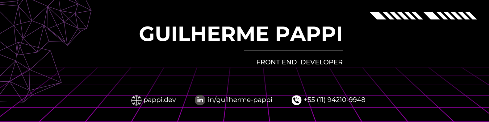

## 👾 Hey! I'm < Guilherme /> and I build stuff

I’m a full-stack developer who enjoys building things and creating practical solutions. I currently work mostly with JavaScript, TypeScript, React, .NET, SQL, and Python, but I enjoy exploring and learning other tools and stacks to apply in my projects. Here, you’ll find projects that blend curiosity, learning, and a personal touch

---

## 🧰 Main Stacks & Tools
- **Frontend:** JavaScript, TypeScript, React, Next.js, jQuery, Figma 
- **Backend:** .NET, Node, Python
- **Databases:** MongoDB, SQL (MySQL, SQL Server, PostgreSQL)  
- **Others:** DevOps, AWS, Git, Docker, Postman, CI/CD

---

## 📫 Get in Touch!

