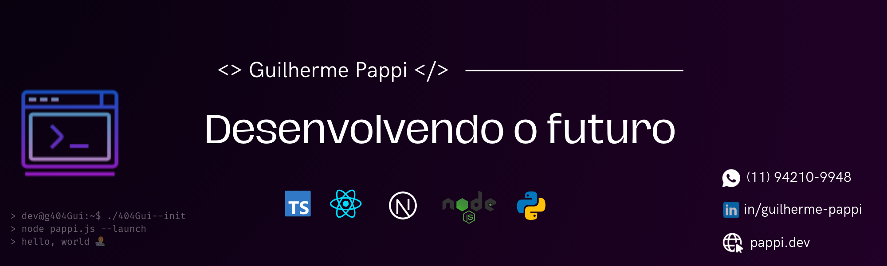

## 👋👾 Olá! Eu sou < Guilherme /> 💻...

Sou um desenvolvedor com experiência full-stack e apaixonado por construir coisas e por criar soluções práticas. Atualmente trabalho principalmente com **JavaScript, TypeScript, React, .NET, SQL e Python**, mas gosto de explorar e aprender outras ferramentas e stacks para aplicar em meus projetos. Aqui você vai encontrar projetos que misturam curiosidade, aprendizado e aquele toque pessoal.

---

## 🧰 Principais Tecnologias & Ferramentas
- **Frontend:** JavaScript, TypeScript, React, Next.js, Figma 
- **Backend:** .NET, Node, Python
- **Banco de Dados:** MongoDB, SQL (MySQL, SQL Server, PostgreSQL)  
- **Outros:** Git, Docker, Postman, CI/CD, etc.

---

## 📫 Fale comigo!

